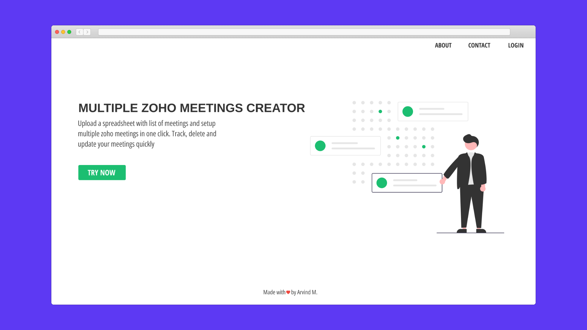

# mutiple_meetings_creator

A flask app to create meetings using spreadsheet data

For work I need to create multiple zoho meetings at a time, sometimes 5 different
meeting in a day 😵 or upto 15 over the week. The data for these meetings i.e 
attendees, date,time etc are always present in some spreadsheet which I then use 
to generate meetings manually. Sometimes i need to update timings etc for those 
meetings too.

I know they are not too much & I can create/update them manually but i am too lazy.
In this app i can just upload that spreadsheet & it creates/updates the meeting 
for me.

# VD




## Development 

### Activate shell

- Make sure you have python3 & pipenv installed

```
pipenv shell
```

## Tests
```
pipenv run tests
```
